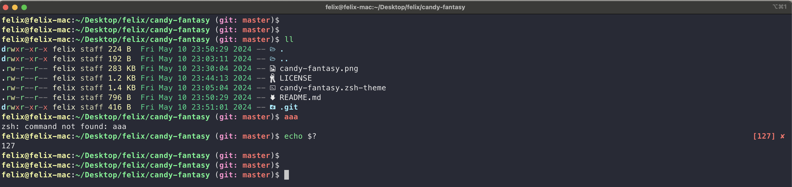

# Candy Fantasy

Candy Fantasy is a theme for Oh My Zsh. It is a modification from the [Candy Kingdom](https://github.com/ohmyzsh/ohmyzsh/blob/master/themes/candy-kingdom.zsh-theme) theme.



## Installation

You should have Oh My Zsh installed. For more details, see [Oh My Zsh's repository](https://github.com/ohmyzsh/ohmyzsh/tree/master).

After installing Oh My Zsh, running `echo $ZSH` should display the path to the `.oh-my-zsh` directory.

```
mkdir -p $ZSH/custom/themes
cd $ZSH/custom/themes
wget https://raw.githubusercontent.com/fffelix-huang/candy-fantasy/master/candy-fantasy.zsh-theme
```

Replace the current theme in your `~/.zshrc` file with `ZSH_THEME="candy-fantasy"`.

To apply the changes, run `source ~/.zshrc` or restart your terminal.
